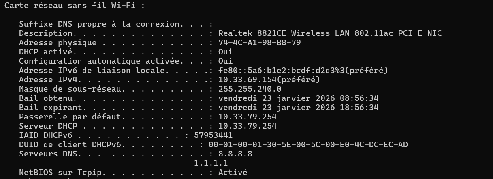
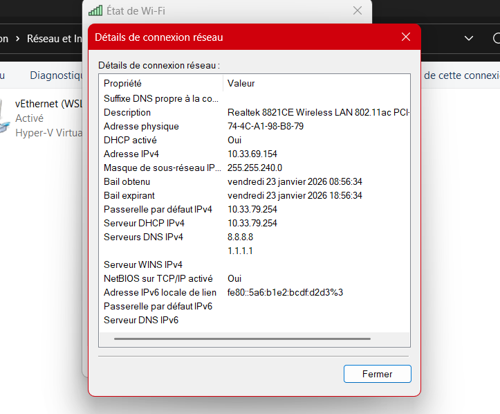

# TP2
## 1. Affichage d'informations sur la pile TCP/IP locale

- Interface wifi : 
    - adresse MAC : ``74-4C-A1-98-B8-79``
    - adresse IP : ``10.33.69.154`` 
        - binaire : ``00001010.00100001.01000101.10011010``
        - masque de sous réseau : ``11111111.11111111.11110000.00000000``
        - adresse de réseau : ``00001010.00100001.01000000.00000000`` -> ``10.33.64.0``
        - adresse de broadcast : ``00001010.00100001.01001111.11111111`` car CIDR /20 -> ``10.33.79.255``

    - adresse de la passerelle : ``10.33.79.254``

- En graphique (GUI : Graphical User Interface):

    

 - à quoi sert la gateway dans le réseau d'Ingésup ?
    - Il sert à pouvoir sortir du réseau wifi étudiant, pour par exemple aller sur internet

## 2. Modifications des informations

### A. Modification d'adresse IP - pt. 1

- Calcul première et dernière ip disponible :
    - comme CIDR /20 il y a 2^12 = 4096 ip disponibles si on enlève les 2 ip déjà utilisé, il reste 4094 ip
    - ``10.33.64.1`` -> ``10.33.79.254``

## 3

- L'adresse ip du serveur DHCP est ``10.33.79.254``

- Pour redemander une adresse ip au serveur on utilise :
    - ``ipconfig /release`` et ``ipconfig /renew``

### Serveur DNS

- Le serveur DNS est le 8.8.8.8

- On peut voir que ynov.com a le même serveur DNS que google.com 
- On peut voir toute les adresses ip du réseau

- La recherche inversé nous donne des noms de domaine

- Pour 78.78.21.21 : ça ressemble à un domaine pour des opérateurs en ligne