# A.Base64
## 1.Génération d'un fichier binaire

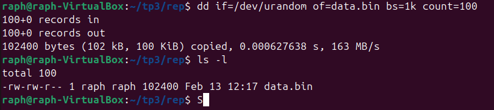
- On voit que la taille du fichier est de 102Ko

## 2.Encodage

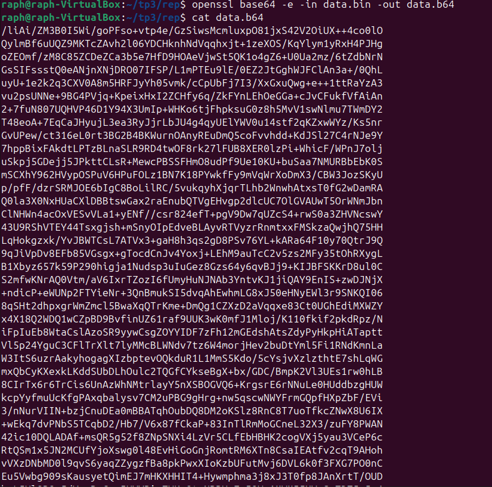
- Création du fichier data.b64 encodé en base64

### Comparaison taille des fichiers
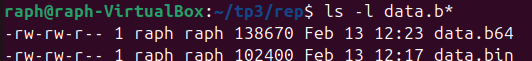
- Le fichier data.b64 prend plus de place que le fichier data.bin

## 3.Décodage

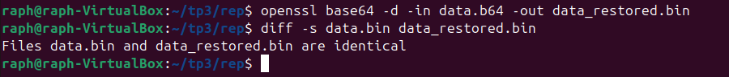

- Décodage du fichier data.b64 dans un nouveau fichier data_restored.bin
- On peut voir que le fichier de base data.bin et le fichier décodé son identique

## 4.Questions

- 1.Base64 est-il un chiffrement ? Pourquoi ?
    - Le base64 n'est pas un chiuffrement, c'est un encodage des données 
    - Base64 représente seulement les données binaires sous forme de texte ASCII

- 2.Pourquoi la taille du fichier change-t-elle après encodage ?
    - La taille change après l'encodage car les données sont représenté en ASCII ce qui prends plus de place que les données bianires avant l'encodage

- 3.Quel est approximativement le pourcentage d’augmentation ?
    - Le pourcentage d'augmentation est d'approxativement 33%

- 4.Quelle méthode permet de vérifier rigoureusement que deux fichiers sont identiques ?
    - La méthode avec ```diff -s``` permet de vérifier que les fichier sont identiques
    - On peut aussi utiliser ```sha256sum``` avec le nom des fichiers que l'on veut comparer, qui permet de vérifier que les empreintes fichiers soient bien identiques

# B.Chiffrement symétrique – AES

## 1.Création d’un message


- Création du fichier confidentiel.txt


## 2.Chiffrement

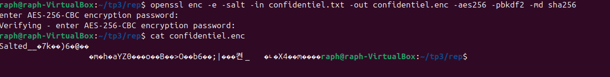

- Le contenue du fichier confidentiel.txt a bien été chiffré, on voit qu'en affichant le contenu de confidentiel.enc, le contenue est bien bianire

## 3.Déchiffrement

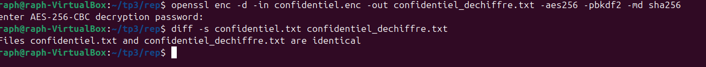

- Le fichier confidentiel.enc a bien été déchiffré vers le fichier confidentiel_dechiffre.txt. On peut voir que le fichier déchiffré est bien le même que le fichier de base confidentiel.txt

## 4.Analyse

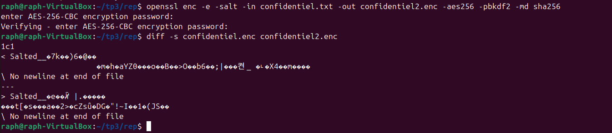

- Les deux fichier chiffré avec le même mot de passe et le même chiffrement ne sont pas les mêmes

## 5.Questions

- 1.Pourquoi les deux fichiers chiffrés sont-ils différents ?
    - Les deux fichiers chiffrés sont différents car le sel est généré aléatoirement à chaque chiffrement donc le contenue des fichiers chiffrés sont différents

- 2.Quel est le rôle du sel ?
    - Le rôle du sel est d'ajouter une donnée aléatoire au mot de passe, ce qui sert à empecher deux fichier chiffrés avec le même mot de passe soient identiques, ce qui rejoute donc une sécurité en pkus en cas d'attaque

- 3.Que se passe-t-il si une option change lors du déchiffrement ?
    - Si les options ne sont pas les mêmes alors le déchiffrement échoue ou il produit des données incohérentes

- 4.Pourquoi utilise-t-on PBKDF2 ?
    - On utilise PBKDF2 pour transformer le mot passe faible en clé forte, se qui rend la casse du mot de passe beaucoup plus compliqué et ainsi évite que l'on vole nos données trop facilement

- 5.Quelle est la différence entre encodage et chiffrement ?
    - La différence est que l'encodage n'est pas sécuriser, n'utilise pas de clé et est réversible par tout le monde. Contrairement au chiffrement qui lui est sécurisé, utilise une clé etne peut être déchiffré que par cette clé

# C.Cryptographie asymétrique-RSA

## 1.Génération de clés

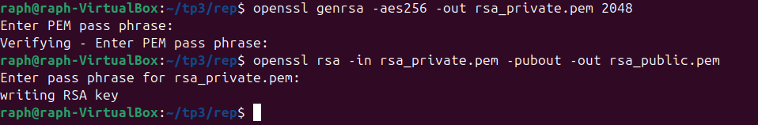

- Création de la clé privé puis de la clé publique 

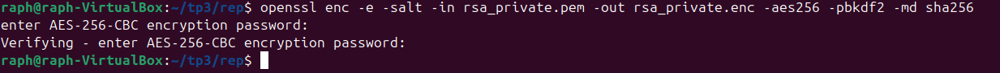

- Chiffrement de la clé privé

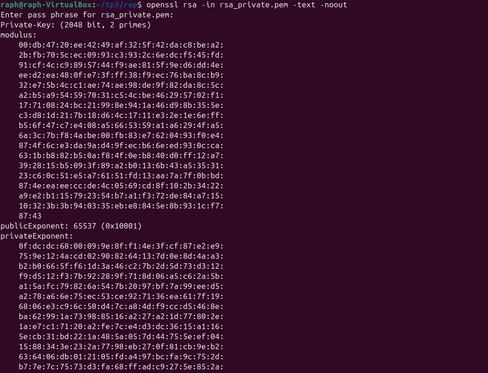
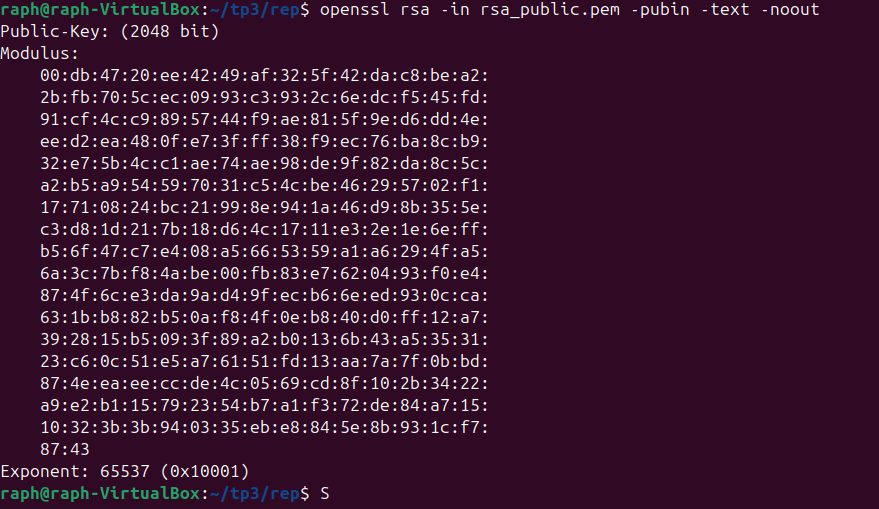

- On peut voir que la clé privé comporte plus de paramètre que la clé public, le modulus et publicExponent sont les mêmes

## 2.Chiffrement asymétrique


- Le fichier secret.txt a été chiffré  avec la clé public puis déchiffré avec la clé privé, on voit que le fichier secret2.txt est bien le même qu ele fichier d'origine donc le déchiffrement a bien fonctionné

## 3.Questions

- 1.Pourquoi la clé privée ne doit-elle jamais être partagée ?
    - La clé privé ne doit jamais être partagé car c'est grâce à cette clé que l'on peut déchiffré tout les message qui ont été chiffré par la clé public associé donc si on la partage n'importe qui peut déchiffré les messages chiffré par la clé public

- 2.Pourquoi RSA n’est-il pas adapté au chiffrement de gros fichiers ?
    - Le chiffrement RSA n'est pas adapté au chiffrement de gros fichier car ce type de chiffrement est long et il ne prend que des tailles de fichier défini par exemple avec 2048

- 3.Quelles différences observe-t-on entre les paramètres d’une clé publique et d’une clé privée ?
    - Les différence obsérvé sont :
        - Exposant privé
        - Prime1
        - Prime2
        - Coefficients CRT
    - Ces éléments permettent le déchiffrement rapide du fichier

- 4.Quel est le rôle du modulo dans RSA ?
    - Le rôle du modulo dans RSA est de définir la taille de la clé, garantit la difficulté du problème pour chiffré/déchiffré 

- 5.Pourquoi utilise-t-on souvent RSA pour chiffrer une clé AES plutôt qu’un document entier ?
    - Car c'est plus rapide, ça rajoute une sécuité en plus et augmente l'éfficacité du chiffrement

# D.Signature numérique

## 1.Création et signature

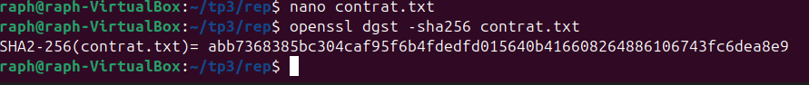

- Création du fichier contrat.txt et génération de l'empreinte 

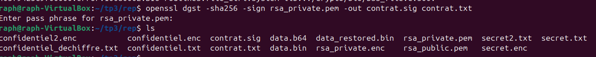

- Le fichier de signature contrat.sig a bien été crée

## 2.Vérification

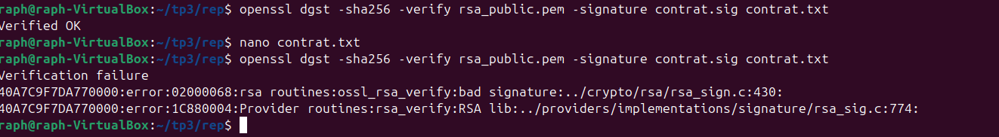

- On vérifie la signature avec la clé publique.

## 3.Questions 

- 1.Que se passe-t-il après modification du fichier ?
    - Après la modification du fichier, la vérification de la signature échoue

- 2.Pourquoi ?
    - La vérification échoue car lorsque que l'on change un caractère l'empreinte du fichier change, comme on a modifié le fichier initial, une nouvelle empreinte a été crée

- 3.Quel est le rôle du hachage dans le mécanisme de signature ?
    - Le rôle du hachage pour la signature est que si on ne l'avait pas fait la signature serait trop lourde, moins sécurisé et moins éfficace. C'est pour ça que l'on hash avant de signer

- 4.Quelle différence entre signature numérique et chiffrement ?
    - LA différance entre la signature et le chiffrement est que la signature est là pour prouver l'authenticité du fichier, tout le monde peut verifier grâce à la clé publique. C'est donc un moyen de prouver que le fichier nous appartient bien