# Partie 1
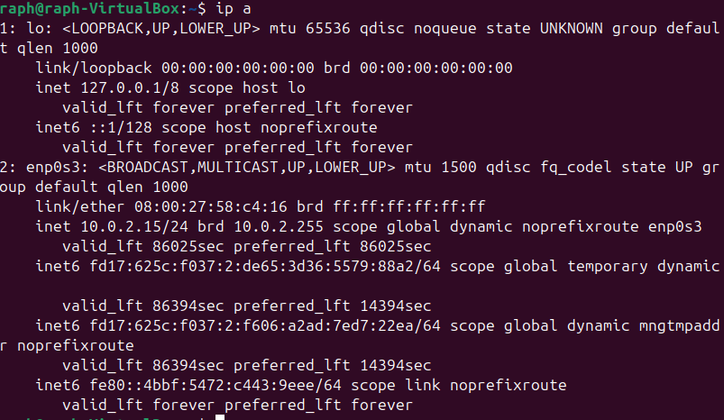

- IP de la Vm pour ssh : 127.0.0.1

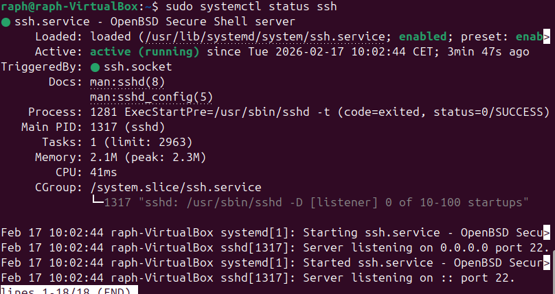

- Le serveur ssh est bien activé

## Connexion ssh 
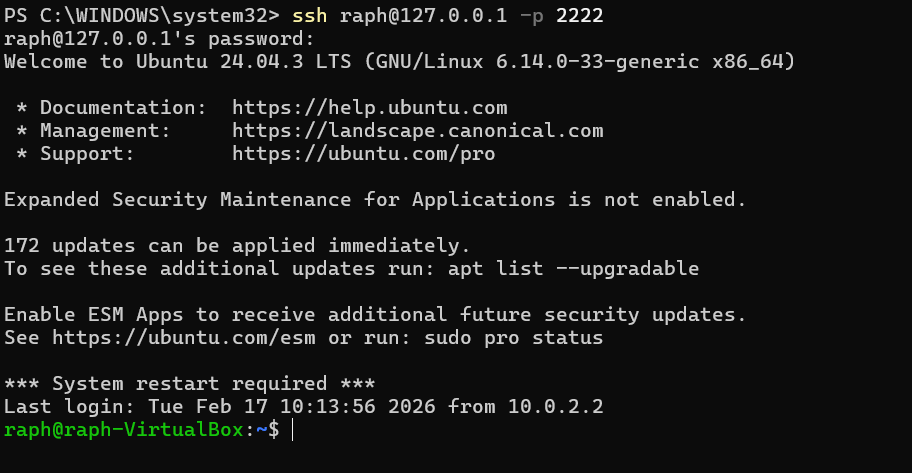

- Connexion en ssh grâce au mot de passe
# Partie 2
## Génération de clé ssh

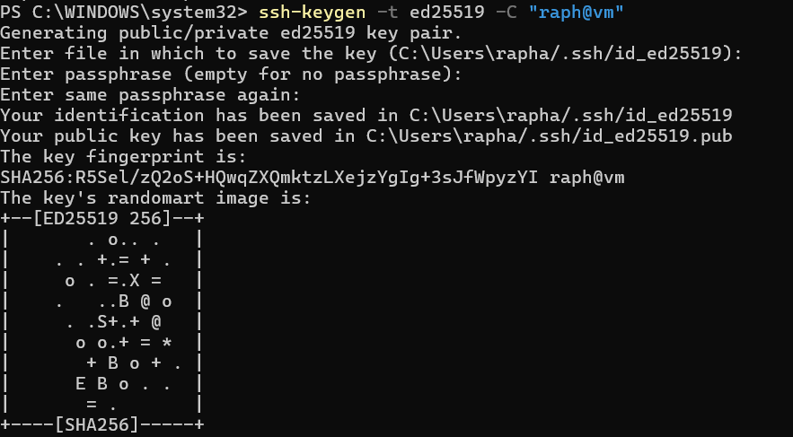
- Génération de la clé ssh 

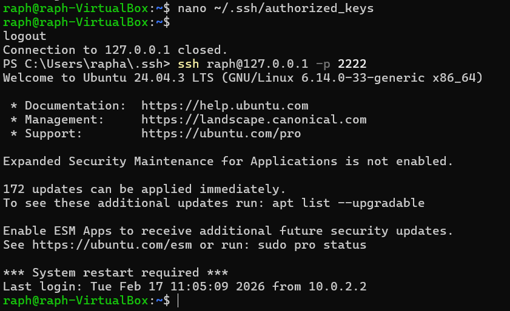

- Copie de la clé public dans la vm 
- La connexion ssh fonctionne maitenant grâce à la clé

# Partie 3

- Nouvelle adresse ip : 10.97.161.97

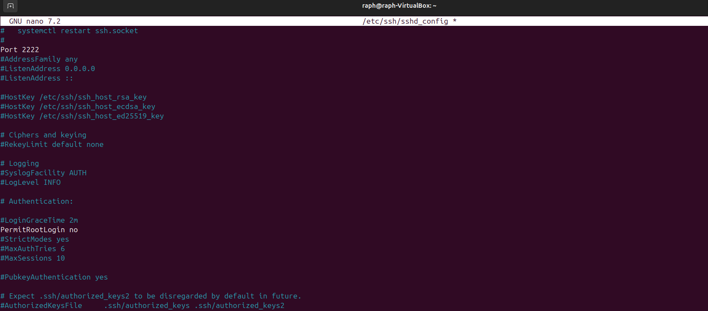
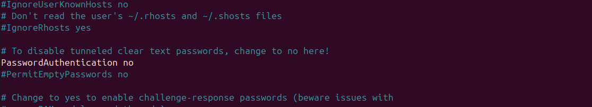

- Modification des autorisations du ssh

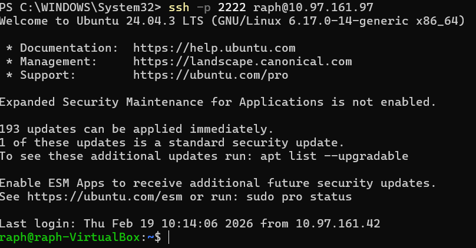

- connexion avec le nouveau port

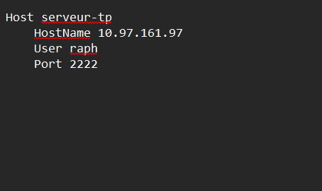
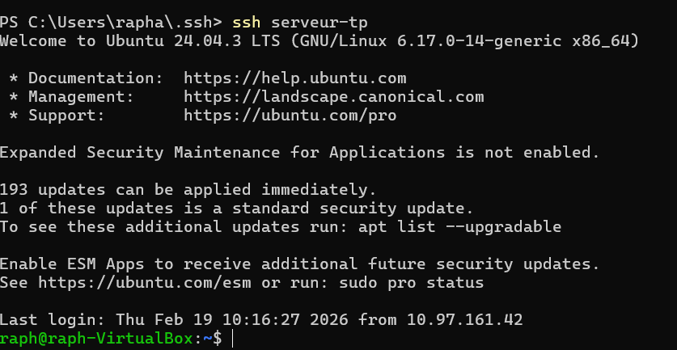

- Connexion avec l'alias serveur-tp

# Partie 4 - Transferts de fichiers

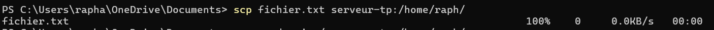
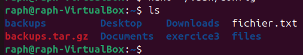

- Transfert du fichier fichier.txt du client au serveur

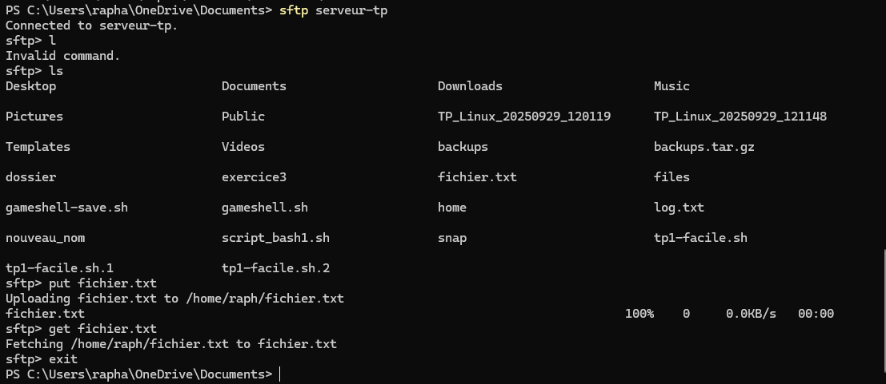

- transfert de fichier grâce au sftp

# Partie 5 – Analyse des logs et sécurité

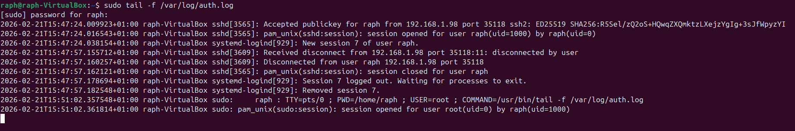

- Récupération des dernières tenteatives de connexion du serveur ssh

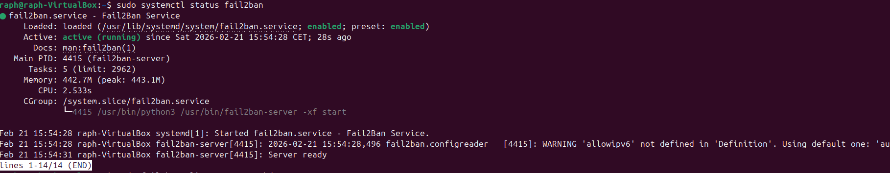

- Mise en place du service fail2ban .

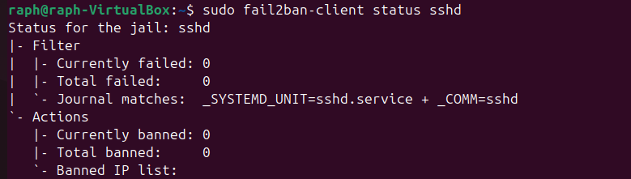

- On voit qu'aucune connexion n'a echoué

# Partie 6 – Tunnel SSH

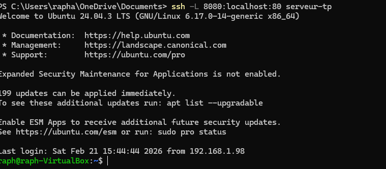

- Création du tunnel local 

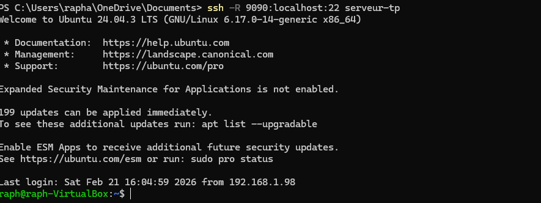

- Création du tunnel distant

# Partie 7 – Nginx et HTTPS

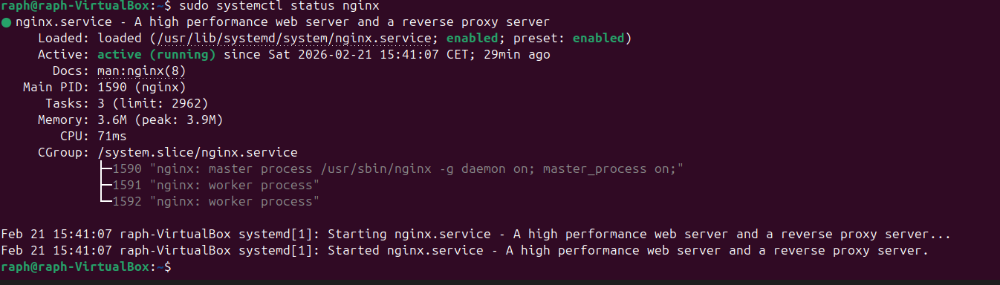

- Serveur nginx lancé

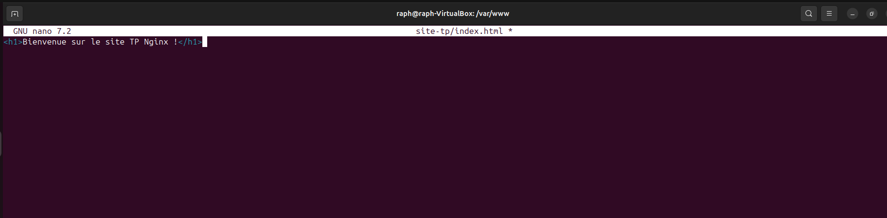

- Création de la page index.html du site du serveur Nginx

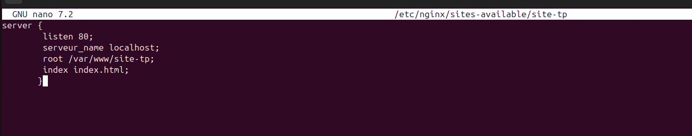

- Mise en place du site dans le serveur

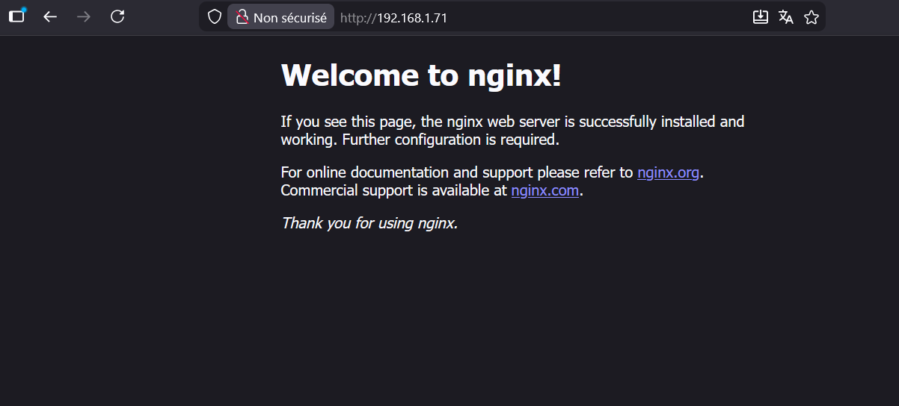

- le serveur fonctionne bien 

- Création du certificat auto-signé

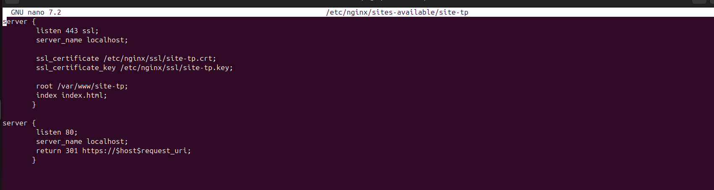

- COnfiguration pour le https

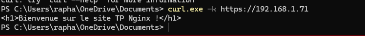
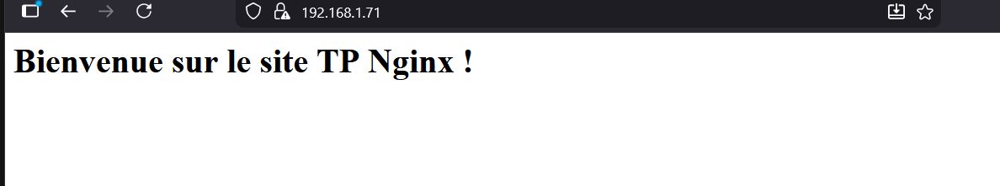

- le site est bien affiché avec le serveur https et nginx

# Partie 8 – Firewall et permissions

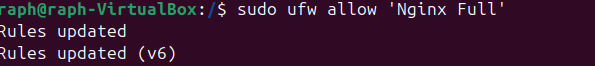
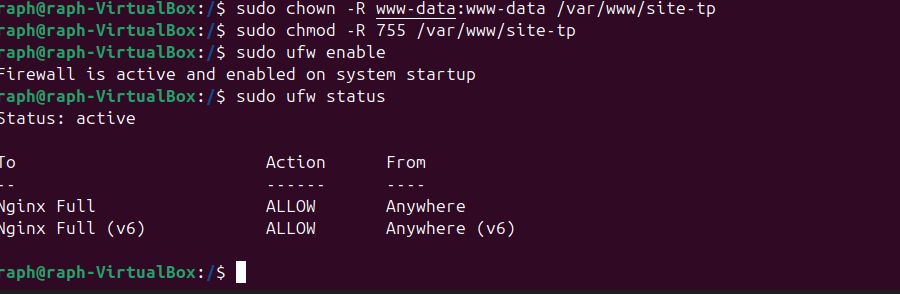

- Le firewall est bien actif sur notre serveur nginx