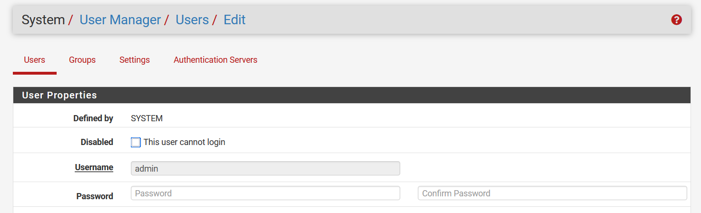
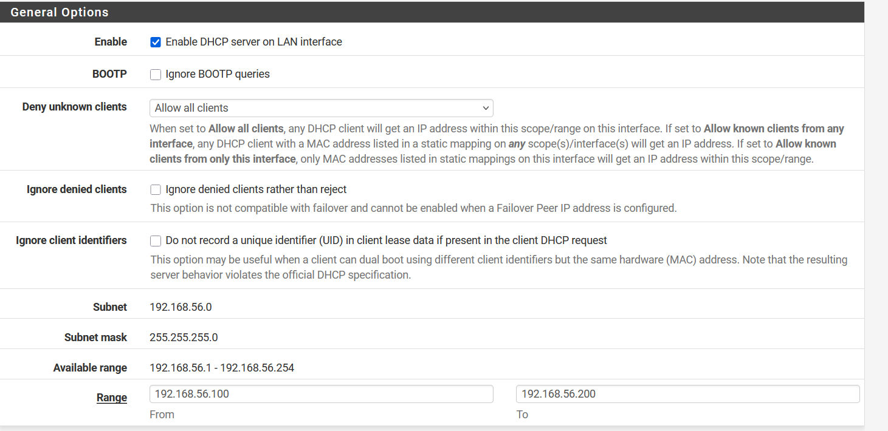
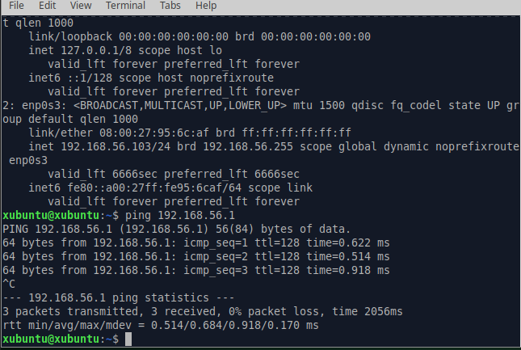
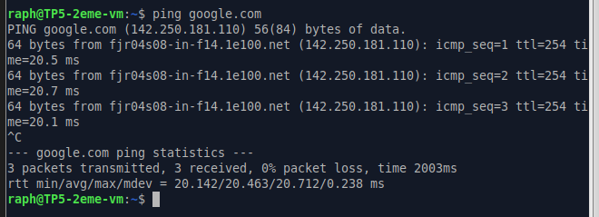
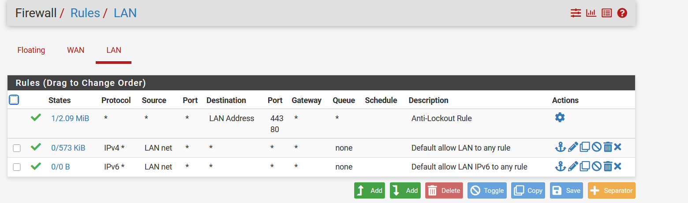

# Partie 1 – Prise en main et sécurisation
## 1. Accès à l’interface
### Questions
- L'adresse ip du LAN : 192.168.56.2

- L'adresse ip du WAN : 

- Pourquoi utilise-t-on HTTPS ?
    - On utilise HTTPS car les règles du firewall sont sensibles, pour proteger les échanges et les identifiants admin sont connus de tous

- Pourquoi faut-il changer les identifiants par défaut sur un pare-feu ?
    - Il faut changer les identifiants par défaut sur un pare-feu car tout le monde à le même de base donc si quelqu'un se connecte sur notre réseau, il peut se connecter à noter pare-feu

## 2. Sécurisation de l’accès administrateur
### Questions

- Où se gèrent les utilisateurs ?
    - Les utilisateurs se gèrent dans : 

- Qu’est-ce qu’un mot de passe robuste ?
    - Un mot de passe robuste est un mot de passe qui est long avec des majuscule, minuscule, caractères spéciaux et qui ne comporte pas de mot connue(nom, prénom, nom animal)

- Pourquoi sécuriser en priorité l’accès admin sur un équipement réseau ?
    - Il faut sécuriser l'accès admin en priorité car n'importe qui pourrait si connecter sinon

# Partie 2 – Comprendre les interfaces réseau
## 3. Vérification des interfaces
### Questions
- Quelle interface permet l’accès Internet ?
    - L'interface qui permet de l'accès à internet est l'interface WAN

- Quelle interface correspond au réseau interne ?
    - L'interface qui correspond au réseau interne est l'interface LAN

- Que se passerait-il si les interfaces étaient inversées ?
    - Si les interfaces étaient inversées, on aurait plus accès à pfsense, le lan serait exposé à internet

# Partie 3 – Configuration des services réseau
## 4. DHCP

- VM connecté sur le serveur dhcp, ip : 192.168.56.103

### Questions
- Pourquoi utiliser DHCP plutôt qu’une IP fixe ?
    - On utilise un DHCP plutôt qu'une ip fixe car on ne connait pas le nombre d'appareils qui se connecteront à notre firewall donc on utilise un serveur DHCP qui attribuerat des ip automatiquement pour tous 

- Quelle plage d’adresses choisir ?
    - On choisit une plage d'adresses en fonction de l'adresse ip du firewall, ici 192.168.56.x

- Quelles adresses faut-il éviter d’inclure dans la plage ?
    - Les adresses à éviter d'inclure sont : 
        - 192.168.56.1 : adresse vers le serveur
        - 192.168.56.2 : adresse du firewall

## 5. DNS

- Une fois le DNS configuré je peux ping google.com
### Questions
- Pourquoi un pare-feu peut-il jouer le rôle de serveur DNS ?
    - Un pare-feu peut jouer le rôle de serveur DNS car il est entre le LAN et le WAN donc entre le réseau interne et internet, et que le pare-feu est la passerelle par défaut sur le réseau

- Que se passe-t-il si le DNS ne fonctionne pas mais que le ping vers 8.8.8.8 fonctionne ?
    - ça veut dire que la connexion internet fonctionne mais que la résolution du DNS ne fonctionne pas, on peut donc ping 8.8.8.8 mais pas google.com

# Partie 4 – Autoriser l’accès Internet
## 6. Règles de pare-feu

### Questions
- Quelle doit être la source ?
    - La source doit être LAN net
- Quelle doit être la destination ?
    - La destination doit être tout (*)
- Faut-il autoriser tous les protocoles ?
    - 